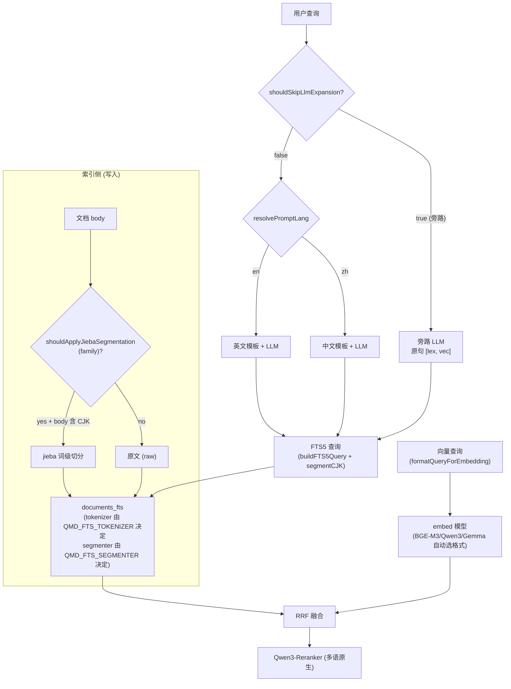
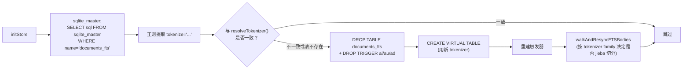
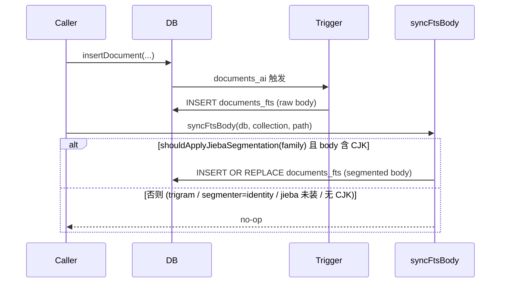

# 中文支持 — 设计与实现参考

> 配套实施计划：[CHINESE_SUPPORT_PLAN.md](./CHINESE_SUPPORT_PLAN.md)
> 受众：维护者、reviewer、未来需要扩展多语支持的开发者
> 上游：本仓库 fork 自 [tobi/qmd](https://github.com/tobi/qmd)，本设计目标之一是降低后续 rebase 成本

## 1. 背景

### 1.1 问题诊断

QMD 的检索流水线对中文存在三个层面的问题：

**1.1.1 全文检索（FTS5）**

`src/store.ts` 中创建虚表使用 `tokenize='porter unicode61'`：

```sql
CREATE VIRTUAL TABLE documents_fts USING fts5(
  filepath, title, body,
  tokenize='porter unicode61'
);
```

`unicode61` tokenizer 在缺省配置下把每个汉字视为独立 token（中文字符之间没有分隔符），等价于"字"级分词。BM25 在字级 token 上失去 IDF 区分度，对常见字（"的""是""中"）打分严重失真，召回与排序均受影响。

**1.1.2 向量模型提示词**

`src/llm.ts` 中：

```ts
export function isQwen3EmbeddingModel(uri: string) { /* 正则匹配 qwen.*embed */ }
export function formatQueryForEmbedding(q: string, modelUri?: string): string {
  if (isQwen3EmbeddingModel(uri)) return `Instruct: ... Query: ${q}`;
  return `task: search result | query: ${q}`;  // embeddinggemma 风格
}
```

只有 embeddinggemma 与 Qwen3-Embedding 两套硬编码 prompt。若用户通过 `QMD_EMBED_MODEL` 切换到 BGE-M3（多语首选），代码会错误地套上 embeddinggemma 的 `task: search result | query: …` 前缀，污染向量空间，与 BGE-M3 训练时的 raw-text 编码方式不一致。

**1.1.3 LLM Query Expansion**

默认生成模型 `qmd-query-expansion-1.7B-gguf` 是用全英文 SFT 数据训练的本地微调模型，且 `expandQuery` 中提示词硬编码：

```ts
const prompt = intent
  ? `/no_think Expand this search query: ${query}\nQuery intent: ${intent}`
  : `/no_think Expand this search query: ${query}`;
```

中文查询会得到无意义的英文 hallucination。即便用户切换 `QMD_GENERATE_MODEL` 到通用中文模型（如 Qwen3-1.7B-Instruct），英文指令依然挂着，结果仍偏离最佳。

此外 `hasQueryTerm` 用 `replace(/[^a-z0-9\s]/g, " ")` 粗暴抹除非 ASCII，对中英混合查询的过滤逻辑失效。

### 1.2 不变的部分

- **chunking**：基于 markdown 标题/段落/换行的 break-point 策略对中文天然适配（中文段落仍有 `\n\n` 分隔，标题用 `#`）。
- **reranker**：Qwen3-Reranker-0.6B 是多语模型，无需替换。
- **schema**：除 FTS 虚表外的所有表结构无需变更。

## 2. 设计原则

| 原则 | 含义 |
|------|------|
| **零默认行为变化（ASCII 严格、CJK 改进）** | **作用域（review-5 #1 限定 + review-6 #1 精确化）**：未设任何 env 时，**ASCII 查询路径**输出与上游 byte-identical（FTS schema、embedding prompt、English LLM expansion prompt、English 查询返回结构均不变）。**CJK 查询路径**默认有改进性变化：`shouldSkipLlmExpansion(auto+CJK+默认模型)=true` 旁路英文专用 LLM，返回 `[lex, vec]` 原句。这不是回归（上游 CJK 路径本就是英文 prompt 配中文查询，输出近似乱码），而是从"破"到"原句兜底"。**完整恢复**上游 CJK 行为（英文 prompt + 调 LLM）需显式设 `QMD_EXPAND_LANG=en`（`=force` 在 CJK 下会用中文 prompt，并不等价上游）。**FTS body 形态严格不变（review-4 #1）**：即便 `@node-rs/jieba` 经 `optionalDependencies` 自动安装，只要 `QMD_FTS_SEGMENTER` 默认 `identity`，body 形态、查询切分、segmenter state 与上游完全一致 |
| **能力 vs 开关分层** | `isJiebaAvailable()` 反映模块是否成功加载；`isJiebaActive()` 聚合模块状态与 `QMD_FTS_SEGMENTER` 用户开关。索引/查询路径只看 `isJiebaActive` |
| **加文件 > 改文件** | 把新逻辑放进新模块；现有文件只插入薄 hook |
| **环境变量驱动** | 所有开关通过 env 暴露，避免硬编码或新增 CLI flag |
| **可选依赖优雅降级** | jieba 缺失时 `segmentCJK` 退化为 identity；用户可显式设 `QMD_FTS_TOKENIZER=auto` + `QMD_FTS_SEGMENTER=auto` 让缺失时自动选 trigram、装了就走 jieba |
| **Schema + Segmenter 双自愈** | tokenizer 改变 → schema 重建；segmenter active 状态改变 → walk-resync FTS body；两者都不需要用户运行迁移脚本 |
| **fork 合并友好** | 改动集中在已有"扩展点"，rebase 时冲突面最小 |

## 3. 架构总览



## 4. 模块详解

### 4.1 `src/i18n/cjk.ts`

```ts
const CJK_RANGE = /[\u3040-\u30FF\u3400-\u4DBF\u4E00-\u9FFF\uAC00-\uD7AF\uF900-\uFAFF\uFF66-\uFF9F]/u;

export function containsCJK(text: string): boolean {
  return CJK_RANGE.test(text);
}

export function isPredominantlyCJK(text: string, threshold = 0.3): boolean {
  if (!text) return false;
  const cjk = (text.match(new RegExp(CJK_RANGE.source, 'gu')) ?? []).length;
  const totalNonSpace = (text.match(/\S/gu) ?? []).length;
  if (totalNonSpace === 0) return false;
  return cjk / totalNonSpace >= threshold;
}
```

**Unicode 范围说明**：

| 范围 | 内容 |
|------|------|
| U+3040-30FF | 日文平假名/片假名 |
| U+3400-4DBF | CJK 扩展 A |
| U+4E00-9FFF | CJK 基本汉字 |
| U+AC00-D7AF | 韩文音节 |
| U+F900-FAFF | CJK 兼容汉字 |
| U+FF66-FF9F | 半角片假名 |

`isPredominantlyCJK` 用 30% 阈值是个工程取舍：纯中文 ~100%，"How does 中国经济 work" 约 25-40%，"Find docs about machine learning" 约 0%。30% 能可靠把"中文为主"的查询判正，且不会误伤偶尔嵌入英文术语的查询。

### 4.2 `src/embedFormat.ts`

```ts
export type EmbedFormatId = 'gemma' | 'qwen3' | 'bge-m3' | 'raw';

export interface EmbedFormat {
  query: (q: string) => string;
  doc: (text: string, title?: string) => string;
}

export const FORMATS: Record<EmbedFormatId, EmbedFormat> = {
  gemma: {
    query: q => `task: search result | query: ${q}`,
    doc: (t, h) => `title: ${h || "none"} | text: ${t}`,
  },
  qwen3: {
    query: q => `Instruct: Retrieve relevant documents for the given query\nQuery: ${q}`,
    doc: (t, h) => h ? `${h}\n${t}` : t,
  },
  'bge-m3': {
    query: q => q,                         // BGE-M3 retrieval: 原文，无前缀
    doc: (t, h) => h ? `${h}\n${t}` : t,
  },
  raw: {
    query: q => q,
    doc: (t, h) => h ? `${h}\n${t}` : t,
  },
};

export function detectEmbedFormat(uri: string): EmbedFormatId {
  const override = process.env.QMD_EMBED_FORMAT?.toLowerCase();
  if (override && override in FORMATS) return override as EmbedFormatId;
  if (/qwen.*embed|embed.*qwen/i.test(uri)) return 'qwen3';
  if (/bge-?m3/i.test(uri)) return 'bge-m3';
  if (/embeddinggemma|gemma.*embed/i.test(uri)) return 'gemma';
  return 'raw';
}
```

**设计决策**：

- 用注册表而非 switch — 每加一种模型只需在表里加一行，不动检测函数。
- BGE-M3 默认 raw 文本：根据 [BGE-M3 论文](https://arxiv.org/abs/2402.03216) 与 FlagEmbedding 文档，retrieval 任务下 query 与 doc 均使用原文，不需要 instruction prefix。
- **故意收紧到 bge-m3**：BGE 家族内部 prompt 约定差异较大（`bge-large-zh-v1.5` 推荐 `"为这个句子生成表示以用于检索相关文章："` 前缀，`gte-Qwen2` 又是另一套）。把 `bge`/`gte`/`bce` 一起归类风险高于收益，因此只内置我们验证过的 `bge-m3`，其他变体走 `raw` 兜底，需要时用户用 `QMD_EMBED_FORMAT=bge-m3` 强制套用，或自己 PR 新 strategy。
- 优先级：`QMD_EMBED_FORMAT` env 覆盖 > URI 正则匹配 > 默认 `raw`。

`src/llm.ts` 的三个导出函数改为薄壳：

```ts
import { detectEmbedFormat, FORMATS } from "./embedFormat.js";

export function isQwen3EmbeddingModel(uri: string): boolean {
  return detectEmbedFormat(uri) === 'qwen3';   // 保留向后兼容
}
export function formatQueryForEmbedding(q: string, modelUri?: string): string {
  const uri = modelUri ?? process.env.QMD_EMBED_MODEL ?? DEFAULT_EMBED_MODEL;
  return FORMATS[detectEmbedFormat(uri)].query(q);
}
export function formatDocForEmbedding(t: string, title?: string, modelUri?: string): string {
  const uri = modelUri ?? process.env.QMD_EMBED_MODEL ?? DEFAULT_EMBED_MODEL;
  return FORMATS[detectEmbedFormat(uri)].doc(t, title);
}
```

### 4.3 `src/fts/segmentCJK.ts`

**关键改动（采纳 review #1）**：必须**同步加载** `@node-rs/jieba`，因为 `buildFTS5Query` / `searchFTS` / `insertDocument` 等下游路径都是同步的。异步 import + `void preloadJieba()` 会让首查询/首写入在 jieba 未加载时走 identity，造成索引与查询切分不一致。

`@node-rs/jieba` 是 NAPI 模块，CJS 导出，可通过 `node:module` 的 `createRequire` 同步加载：

```ts
import { createRequire } from "node:module";
import { containsCJK } from "../i18n/cjk.js";

type Jieba = { cut: (text: string, hmm?: boolean) => string[] };

const require_ = createRequire(import.meta.url);
let jieba: Jieba | null = null;
let loadError: string | null = null;

try {
  const mod: any = require_('@node-rs/jieba');
  jieba = mod.Jieba ? new mod.Jieba() : mod;
} catch (err) {
  loadError = err instanceof Error ? err.message : String(err);
  jieba = null;
}

export function isJiebaAvailable(): boolean {
  return jieba !== null;
}

export function getJiebaStatus(): { available: boolean; reason?: string } {
  return jieba ? { available: true } : { available: false, reason: loadError ?? 'not installed' };
}

/**
 * 采纳 review-4 #1：能力 (`isJiebaAvailable`) 与开关 (`isJiebaActive`) 解耦。
 * 即便 optionalDependencies 自动安装了 @node-rs/jieba，只要 QMD_FTS_SEGMENTER
 * 默认 'identity'，特性就不会激活，FTS body 保持 raw —— 守住"零默认行为变化"。
 *
 * 采纳 review-5 medium-3：归一化逻辑包成 `resolveSegmenterSetting()` 缓存到模块级，
 * 避免在每次写入/查询路径上重复解析 env、重复 console.warn 刷屏。
 * env 变更通常只在进程启动时发生；测试用例改 env 后调 `__resetSegmenterSettingCache()` 重置。
 */
type SegmenterSetting = "identity" | "jieba" | "auto";
let segmenterSettingCache: SegmenterSetting | null = null;
const warnedUnknownValues = new Set<string>();

function resolveSegmenterSetting(): SegmenterSetting {
  if (segmenterSettingCache !== null) return segmenterSettingCache;
  const raw = (process.env.QMD_FTS_SEGMENTER ?? "identity").toLowerCase();
  if (raw === "identity" || raw === "jieba" || raw === "auto") {
    segmenterSettingCache = raw;
    return raw;
  }
  if (!warnedUnknownValues.has(raw)) {
    warnedUnknownValues.add(raw);
    console.warn(`[qmd] unknown QMD_FTS_SEGMENTER='${raw}', falling back to 'identity'`);
  }
  segmenterSettingCache = "identity";
  return "identity";
}

export function __resetSegmenterSettingCache(): void {
  segmenterSettingCache = null;
  warnedUnknownValues.clear();
}

export function isJiebaActive(): boolean {
  const setting = resolveSegmenterSetting();
  if (setting === "identity") return false;
  return isJiebaAvailable();  // 'jieba' / 'auto' 都要求模块加载成功
}

const CJK_RUN = /[\u3040-\u30FF\u3400-\u4DBF\u4E00-\u9FFF\uAC00-\uD7AF\uF900-\uFAFF\uFF66-\uFF9F]+/gu;

export function segmentCJK(text: string): string {
  // 注意：这里只看模块加载状态 (jieba !== null)，不看 active 开关。
  // 是否调用 segmentCJK 由调用方 (syncFtsBody / buildFTS5Query) 通过
  // shouldApplyJiebaSegmentation(family) 统一决定。
  if (!jieba || !containsCJK(text)) return text;
  return text.replace(CJK_RUN, (run) => jieba!.cut(run, true).join(" "));
}
```

**关键点**：

- **模块顶部同步加载**：模块初始化时一次性尝试 `require`，结果固化到 `jieba` 模块级常量。后续所有调用都是纯同步函数，可被任何同步代码路径直接调用。
- **失败时静默降级**：捕获错误存到 `loadError`，但不抛；`isJiebaAvailable()` 返回 `false`；`segmentCJK` 退化为 identity。原因暴露给 `qmd status`（见 §11）。
- **能力 vs 开关分离（review-4 #1）**：`isJiebaAvailable` 仅反映模块是否成功加载；`isJiebaActive` 把模块状态与 `QMD_FTS_SEGMENTER` 用户开关聚合。索引/查询路径只引用 `shouldApplyJiebaSegmentation(family)`，后者最终走 `isJiebaActive`。
- **只切 CJK 段**：英文部分原样保留，避免 jieba 误处理；输出后送进 FTS5 的 `unicode61` tokenizer 会按空格切，得到正确的词级 token。
- **HMM=true**：jieba 默认参数，对未登录词有更好的切分。

### 4.4 `src/expandPrompt.ts`

```ts
import { isPredominantlyCJK } from "./i18n/cjk.js";

type ExpandPrompt = (q: string, intent?: string) => string;

const PROMPTS: Record<'en' | 'zh', ExpandPrompt> = {
  en: (q, intent) => intent
    ? `/no_think Expand this search query: ${q}\nQuery intent: ${intent}`
    : `/no_think Expand this search query: ${q}`,
  zh: (q, intent) => {
    const head = `/no_think 将以下中文搜索查询扩展为多行结构化输出。
保留 "lex:"/"vec:"/"hyde:" 英文前缀，正文用中文。
- lex 行给 1-3 个关键词（适合 BM25）
- vec 行给 1-3 条自然语言改写（适合向量检索）
- hyde 行给 1 句假设性答案段落
查询：${q}`;
    return intent ? `${head}\n查询意图：${intent}` : head;
  },
};

export type ExpandLangSetting = 'auto' | 'en' | 'zh' | 'force' | 'skip';

/**
 * 把 QMD_EXPAND_LANG 拆成两个正交概念：
 *   1. resolvePromptLang()       —— prompt 模板语言选择（en/zh 二选一）
 *   2. shouldSkipLlmExpansion()  —— 是否跳过 LLM（由 auto/en/zh/force/skip 五值语义决定，
 *                                   详见下方"五值语义矩阵"；review-6 #1 + review-7 #2）
 *
 * 拆分的根本动机：避免上一版"lang === 'zh'"单分支 bug（force 会落到英文模板）。
 * review-6 #1 的关键修订：en/zh/force 都永不旁路；只有 auto 在 CJK + 默认模型时旁路、skip 永远旁路。
 */
export function resolvePromptLang(query: string): 'en' | 'zh' {
  const raw = (process.env.QMD_EXPAND_LANG ?? 'auto').toLowerCase();
  if (raw === 'en') return 'en';
  if (raw === 'zh') return 'zh';
  // auto / force / skip → 按查询脚本判定
  return isPredominantlyCJK(query) ? 'zh' : 'en';
}

export function buildExpandPrompt(query: string, intent?: string): string {
  const override = process.env.QMD_EXPAND_PROMPT;
  if (override) {
    return override.replaceAll('{query}', query).replaceAll('{intent}', intent ?? '');
  }
  return PROMPTS[resolvePromptLang(query)](query, intent);
}
```

**`QMD_EXPAND_LANG` 五值语义**：详见下方 §4.4 末尾的"五值语义矩阵"（采纳 review-7 #1：删除此处旧表，避免与 review-6 #1 修订后的伪代码冲突。旧表错误地写 `en`/`zh` 在 CJK + 默认模型仍会旁路，新逻辑下 `en`/`zh`/`force` 永不旁路）。

**Grammar 兼容性**：原 grammar 是 `lex|vec|hyde` ASCII 标签 + `[^\n]+` 任意 UTF-8 内容；中文模板没有破坏这个约束。

**为什么内置而非纯 env 覆盖**：用户最可能的中文场景是"切个生成模型马上能用"，要求他们手写 prompt 模板会显著抬高门槛。注册表内置默认 + env 覆盖兜底，对应 embedFormat 的设计风格。

### 4.5 expandQuery 注入逻辑

**关键改动（采纳 review #2）**：旁路 LLM 必须发生在 [`store.ts:expandQuery` L3258-3290](../src/store.ts#L3258-L3290)，**不是** [`llm.ts:expandQuery`](../src/llm.ts)。原因是 store 层有一行：

```ts
// src/store.ts L3282-3284
const expanded: ExpandedQuery[] = results
  .filter(r => r.text !== query)    // ← 这里
  .map(r => ({ type: r.type, query: r.text }));
```

如果在 `llm.ts` 层返回 `[lex, vec, hyde]` 全是 `query` 原句，store 层会全部过滤掉，`expanded.length === 0`，hybridQuery 拿不到任何展开式 → 端到端没有原句 lex/vec 检索，行为完全没按设计发生。

正确的注入点是 store 层。同时 hyde 用原句没意义（hyde 的核心是"假设性文档"），CJK 旁路只发出 `[lex, vec]`：

```ts
// src/store.ts:expandQuery 顶部
// review-2 #3 修正：从 expandPrompt.ts 直接 import（不反向依赖 llm.ts）
// review-9 #1 修正：必须沿用既有 llmOverride 通道，否则会绕过 createStore() 注入的 store.llm
import { shouldSkipLlmExpansion } from "./expandPrompt.js";
import { getDefaultLlamaCpp, type LlamaCpp } from "./llm.js";

export async function expandQuery(
  query: string,
  model: string = DEFAULT_QUERY_MODEL,
  db: Database,
  intent?: string,
  llmOverride?: LlamaCpp,
): Promise<ExpandedQuery[]> {
  const llm = llmOverride ?? getDefaultLlamaCpp();              // ← 与 L3276 既有写法一致
  const usingDefaultGenerateModel = llm.usingDefaultGenerateModel();
  if (shouldSkipLlmExpansion(query, { usingDefaultGenerateModel })) {
    // 直接构造 ExpandedQuery，不经过 LLM，不经过 r.text !== query 过滤，也不进 cache
    return [
      { type: "lex", query },
      { type: "vec", query },
    ];
  }

  // 原有 cache 查询 + LLM 调用 + 过滤逻辑保持不变
  // 后续 await llm.expandQuery(query, { intent }) 复用同一个 llm 实例
}
```

**实现注意（review-9 #1 + review-10 #1）**：本节后面 §4.5 末尾还有一段相同伪代码 —— 完整三路径分流见那里。这两段保持完全一致，避免实现者复制其中一段就漏掉 `llmOverride`/`{ usingDefaultGenerateModel }`。

`shouldSkipLlmExpansion` 在 `src/expandPrompt.ts` 实现（避免 store.ts 反向依赖 llm.ts，符合现有分层）：

```ts
// src/expandPrompt.ts
/**
 * 采纳 review-6 #1 / review-8 #1 / review-8 #3：
 * 语义边界：
 *   auto  : 智能模式 —— ASCII 按英文 prompt 调 LLM；CJK + 默认模型 → 旁路返回原句；CJK + 自定义模型 → 中文 prompt 调 LLM。
 *   en/zh : 锁定 prompt 语言 —— 永远调 LLM；resolvePromptLang 直接返回该值。用户设 'en' 即可恢复上游 "英文 prompt 处理 CJK"。
 *   force : 永远调 LLM；prompt 语言按查询脚本判定（与 auto 的语言选择一致，但不旁路）。
 *   skip  : 永远旁路。
 *
 * review-8 #1：用户设了 QMD_EXPAND_PROMPT 视为"隐式 opt-in，要求用 LLM"，
 *   不再被 auto 默认旁路（除非显式 =skip）。优先级：skip > QMD_EXPAND_PROMPT/force/en/zh > auto。
 *
 * review-8 #3：`usingDefaultGenerateModel` 不再仅看 env，由调用方传入（store.ts 持有 effective LlamaCpp）。
 *   这样配置文件 (config.models.generate) 指定的中文模型也能正确触发"自定义模型"分支。
 *   缺省 true（保守：单元测试不传时按"默认模型"行为，与旁路语义一致）。
 */
export interface SkipLlmOptions {
  usingDefaultGenerateModel?: boolean;  // 默认 true
}

export function shouldSkipLlmExpansion(query: string, options?: SkipLlmOptions): boolean {
  const raw = (process.env.QMD_EXPAND_LANG ?? "auto").toLowerCase();
  if (raw === "skip") return true;                                              // 绝对最高
  if (raw === "force" || raw === "en" || raw === "zh") return false;             // 显式 → 永不旁路
  if (process.env.QMD_EXPAND_PROMPT) return false;                                // review-8 #1：隐式 opt-in
  const usingDefault = options?.usingDefaultGenerateModel ?? true;                // review-8 #3：调用方注入
  return isPredominantlyCJK(query) && usingDefault;                               // auto + CJK + 默认模型 → 旁路
}
```

**调用方注入 effective generate model（review-8 #3 + review-9 #1/#3 配套）**：在 `store.ts:expandQuery` 入口处取 effective LlamaCpp 实例（**必须沿用既有 `llmOverride` 参数**，否则会绕过 `createStore({ db, llm })` 注入的 per-store LlamaCpp，让 `config.models.generate` 失效），再比较 `DEFAULT_GENERATE_MODEL_URI` —— 这正是 [`src/llm.ts:209`](../src/llm.ts#L209) 的 export 名。

```ts
// src/llm.ts —— 暴露两个最小 public 方法（保持 generateModelUri private，封装不漏字段）
export class LlamaCpp {
  // ... 现有 private generateModelUri 字段不变

  /** 用于 store.ts:expandQuery 的旁路决策（review-8 #3） */
  usingDefaultGenerateModel(): boolean {
    return this.generateModelUri === DEFAULT_GENERATE_MODEL_URI;
  }

  /** 用于 qmd status 展示完整 effective URI（review-10 #3：避免 status 因 private 字段卡住） */
  getGenerateModelUri(): string {
    return this.generateModelUri;
  }
}
```

```ts
// src/store.ts:expandQuery 入口（review-9 #1：用 llmOverride 通道，与既有写法对齐）
import { shouldSkipLlmExpansion } from "./expandPrompt.js";
import { getDefaultLlamaCpp } from "./llm.js";

export async function expandQuery(
  query: string,
  model: string = DEFAULT_QUERY_MODEL,
  db: Database,
  intent?: string,
  llmOverride?: LlamaCpp,
): Promise<ExpandedQuery[]> {
  const llm = llmOverride ?? getDefaultLlamaCpp();             // ← 与 L3276 既有写法一致
  const usingDefaultGenerateModel = llm.usingDefaultGenerateModel();
  if (shouldSkipLlmExpansion(query, { usingDefaultGenerateModel })) {
    return [{ type: "lex", query }, { type: "vec", query }];   // 不进 cache、不调 LLM
  }
  // ... 既有 cache 检查与 LLM 调用逻辑不变；后续 await llm.expandQuery(query, { intent }) 复用同一个 llm 实例
}
```

这样以下三种配置都能正确分流：

- `QMD_GENERATE_MODEL=hf:Qwen/...` env → `LlamaCpp` ctor 里就读 env 设成自定义值 → `usingDefault=false` → 不旁路。
- `~/.qmd/config.yaml` 里写 `models.generate: hf:Qwen/...` → [`src/cli/qmd.ts` L123-128](../src/cli/qmd.ts#L123-L128) 走 `setDefaultLlamaCpp(new LlamaCpp({ generateModel: ... }))`；API 路径里 [`createStore`](../src/store.ts#L1598) 把同样 config 的 LlamaCpp 注入到 `store.llm`，再通过 [`expandQuery(... store.llm)`](../src/store.ts#L1646) 作为 `llmOverride` 传入 —— **这正是 review-9 #1 强调的关键路径**。
- 都没设 → `generateModelUri === DEFAULT_GENERATE_MODEL_URI` → `usingDefault=true` → 按 §4.4 矩阵旁路。

**`QMD_EXPAND_LANG` 五值语义矩阵**（QMD_EXPAND_PROMPT 未设、effective generate model 为默认时）：

| 设置 | resolvePromptLang(CJK 查询) | resolvePromptLang(ASCII 查询) | shouldSkipLlmExpansion(CJK + 默认模型) | shouldSkipLlmExpansion(ASCII) |
|---|---|---|---|---|
| `auto`（默认） | `zh` | `en` | **true（旁路）** | false |
| `en` | `en` | `en` | false | false |
| `zh` | `zh` | `zh` | false | false |
| `force` | `zh` | `en` | false | false |
| `skip` | `zh` | `en` | true | true |

**优先级（review-8 #1）**，从高到低：

1. `QMD_EXPAND_LANG=skip` —— 绝对最高，永远旁路。
2. `QMD_EXPAND_LANG ∈ {force, en, zh}` —— 显式选择 prompt 行为，永不旁路。
3. `QMD_EXPAND_PROMPT` 设了任何值 —— 视为"用户提供了模板，要求 LLM 用它" → 永不旁路。
4. `QMD_EXPAND_LANG=auto`（默认）+ CJK 查询 + effective generate model 是默认 → 旁路。
5. 其他情形 —— 按 prompt 模板调 LLM。

**effective generate model（review-8 #3）**：判断"是否默认模型"看 `LlamaCpp.generateModelUri` 与 `DEFAULT_GENERATE_MODEL_URI` 的比较结果，由 `store.ts` 注入。这样 env (`QMD_GENERATE_MODEL`) 与配置文件 (`config.models.generate`) 任一处设了非默认模型都能正确进入"自定义模型"分支，不再仅查环境变量。

**说明**：
- 用户想**完整恢复上游 CJK 行为**（英文 prompt + 调 LLM 处理中文查询）→ `QMD_EXPAND_LANG=en`。
- 用户**强制走中文 prompt**（即便用了能"理解"中文的强模型）→ `QMD_EXPAND_LANG=zh`。
- 用户**禁止任何旁路**但仍按查询脚本智能选模板 → `QMD_EXPAND_LANG=force`。
- 用户**永远旁路** LLM（极快路径，仅返回原句 lex+vec）→ `QMD_EXPAND_LANG=skip`。
- 用户**仅写自定义 prompt 模板**（`QMD_EXPAND_PROMPT="..."`）→ 自动隐式 opt-in，无需另设 `QMD_EXPAND_LANG`。

`llm.ts:expandQuery` 内部仍负责 prompt 构造（`buildExpandPrompt`），不做 CJK 检测：

```ts
// src/llm.ts:expandQuery 内部
const prompt = buildExpandPrompt(query, options.intent);  // 替换原硬编码英文 prompt
// 其余 LLM 调用逻辑不变
```

**判断 `usingDefaultGenerateModel`（采纳 review-8 #3 + review-9 #1 + review-10 #2）**：从 **effective LlamaCpp** 取真值，按调用方上下文有两条入口：

- **store 路径**（`store.ts:expandQuery` / `searchFTS` / `hybridSearch` 等数据流）：`const llm = llmOverride ?? getDefaultLlamaCpp()` —— 沿用既有签名的 `llmOverride` 参数，与 [L3276 现有写法](../src/store.ts#L3276) 对齐，覆盖 `createStore({ llm })` 注入的 `store.llm`（来自 `config.models.generate`）。
- **status 路径**（`qmd status` 命令展示）：`const llm = store.llm ?? getDefaultLlamaCpp()` —— 直接从 store 实例读 `llm` 字段。

`shouldSkipLlmExpansion(query, { usingDefaultGenerateModel })` 接收注入参数，单元测试时直接传 `true`/`false` 不需要污染 env。**绝不要写 `getDefaultLlamaCpp().usingDefaultGenerateModel()`**：这会绕过 per-store LlamaCpp 注入，让 `config.models.generate` 配置失效。

**为什么 CJK 旁路放到 store 层而不是 llm 层**：

- 避开 `r.text !== query` 过滤。
- 跳过 cache 查询（旁路结果是恒等映射，缓存无收益）。
- 减少 `llm.ts:expandQuery` 内部的分支复杂度（只关心 prompt 选择）。
- store 层是检索流水线的"指挥中心"，从这里短路最直观。

## 5. 行为矩阵（review-8 #2 重写：与 §4.4 五值矩阵同构）

> 默认 effective generate model（用户既未设 `QMD_GENERATE_MODEL` env，也未在 `config.models.generate` 配置）的情形：

| 查询 | `QMD_EXPAND_LANG` | `QMD_EXPAND_PROMPT` | resolvePromptLang | shouldSkipLlmExpansion | 结果 |
|------|-------------------|---------------------|-------------------|------------------------|------|
| 英文 | `auto`（默认） | 未设 | `en` | false | 英文模板 + LLM（**行为不变**） |
| 英文 | `en` | 未设 | `en` | false | 英文模板 + LLM |
| 英文 | `zh` | 未设 | `zh` | false | 中文模板 + LLM |
| 英文 | `force` | 未设 | `en` | false | 英文模板 + LLM |
| 英文 | `skip` | 任意 | `en` | true | 旁路，返回原句 `[lex, vec]` |
| 英文 | 任意非 skip | 任意非空 | （由 LANG 决定） | false | **完全用 `QMD_EXPAND_PROMPT` 模板** + LLM |
| 中文 | `auto`（默认） | 未设 | `zh` | **true** | 旁路，返回原句 `[lex, vec]`（**默认改进**） |
| 中文 | `en` | 未设 | `en` | false | 英文模板 + LLM（**等价上游 CJK 行为**） |
| 中文 | `zh` | 未设 | `zh` | false | 中文模板 + LLM |
| 中文 | `force` | 未设 | `zh` | false | 中文模板 + LLM |
| 中文 | `skip` | 任意 | `zh` | true | 旁路 |
| 中文 | 任意非 skip | 任意非空 | （由 LANG 决定） | false | **完全用 `QMD_EXPAND_PROMPT` 模板** + LLM |

> **自定义 effective generate model**（`QMD_GENERATE_MODEL` 或 `config.models.generate` 任一不为默认）：

| 查询 | `QMD_EXPAND_LANG` | shouldSkipLlmExpansion | 结果 |
|------|-------------------|------------------------|------|
| 中文 | `auto` | false | **中文模板 + LLM**（关键修复：自定义模型有能力处理中文） |
| 中文 | `skip` | true | 旁路 |
| 任意其他组合 | 同上表 | 同上表 | （`auto` 在 CJK 下不再旁路是唯一区别） |

`QMD_EXPAND_PROMPT` 隐式 opt-in（review-8 #1）：只要它不为空字符串/未设，shouldSkipLlmExpansion 永远返回 false（除 `=skip`），并替换 prompt 模板内容（占位符 `{query}`、`{intent}`）。

## 5.5 用户意图速查（与上表互补）

| 用户意图 | 推荐 env 配置 |
|----------|--------------|
| 默认开箱（英文场景行为不变；中文短路兜底） | 不设任何 env |
| 完整恢复上游 CJK 行为（即便输出乱码） | `QMD_EXPAND_LANG=en` |
| CJK 用强中文模型 + 中文 prompt | 设 `QMD_GENERATE_MODEL=hf:Qwen/...`（auto 即可，自动选中文模板） |
| 永远不调 LLM（极快路径） | `QMD_EXPAND_LANG=skip` |
| 完全自定义 prompt 模板 | `QMD_EXPAND_PROMPT="..."`（无需再设 LANG） |
| 强制 LLM 但按查询脚本选模板 | `QMD_EXPAND_LANG=force` |

## 6. FTS Tokenizer 切换语义

### 6.1 Tokenizer allowlist（采纳 review #5）

**`QMD_FTS_TOKENIZER` 不直接拼进 SQL**。维护一个 allowlist，未命中即报错并回退到默认：

```ts
const ALLOWED_TOKENIZERS = new Set([
  'porter unicode61',          // 默认
  'unicode61',
  'unicode61 remove_diacritics 2',
  'trigram',
  'trigram case_sensitive 0',
  'trigram remove_diacritics 1',
  'ascii',
]);

const AUTO_VALUE = 'auto';

function resolveTokenizer(): string {
  const raw = process.env.QMD_FTS_TOKENIZER?.trim() ?? "porter unicode61";
  if (raw === AUTO_VALUE) {
    // review-2 #6：auto 是显式 opt-in 才会发生的语义切换。
    // review-4 #1：基于 isJiebaActive() 而非 isJiebaAvailable()，
    // 这样 segmenter=identity 时 auto 仍退到 trigram，避免选了 porter 却没词级切分的错配。
    return isJiebaActive() ? "porter unicode61" : "trigram";
  }
  if (ALLOWED_TOKENIZERS.has(raw)) return raw;
  process.stderr.write(
    `QMD Warning: invalid QMD_FTS_TOKENIZER="${raw}", using default 'porter unicode61'.\n`
  );
  return "porter unicode61";
}

function getTokenizerFamily(t: string): string {
  return t.trim().split(/\s+/)[0]?.toLowerCase() ?? '';
}
```

允许的合法值通过 `qmd status` 暴露。如果 reviewer 或 power user 需要扩展，加进 `ALLOWED_TOKENIZERS` 即可。

### 6.2 自愈重建流程

**关键改动（采纳 review #7）**：以 `sqlite_master` 实际 schema 为唯一真源，**不引入 `store_config.fts_tokenizer`**。否则用户手动改 schema 或两次升级之间状态不同步会陷入"双真源漂移"。



**关键改动（采纳 review-3 #4）**：重建流程的最后一步**不是**裸 SQL `INSERT...SELECT`，而是调用 §6.6 的 `walkAndResyncFTSBodies`，它会按当前 tokenizer family 决定是否对 body 做 jieba 预切分。否则 `porter unicode61` → `porter unicode61` 切换不会发生（无变化），但 `trigram` → `porter unicode61` 时如果只跑裸 SQL，body 会落成 raw，下次再靠 segmenter-state 检测才能补上 —— 路径冗长且易踩坑。直接在重建里 walk-and-segment 是单次结束。

每次 `initStore` 都做 schema 解析与对比；解析成本一次几十微秒，可忽略。即便用户从 sqlite shell 手动改 schema，下次启动也会自动校正。

### 6.3 索引大小与查询长度影响

| Tokenizer | 中文 token 粒度 | 英文 BM25 质量 | 索引体积（中文文档相对值） | 短 CJK 查询召回 |
|-----------|----------------|----------------|---------------------------|----------------|
| `porter unicode61`（默认） | 字 | 优 | 1x（基线） | 1 字 LIKE-style；2 字以上靠字级 BM25 |
| `trigram` | 3 字 gram | 良（无 stemming） | ~2-3x | **1-2 字 CJK 查询通常无法命中**（trigram 需要 ≥3 字符） |
| `porter unicode61` + jieba 预切分 | 词 | 优 | ~1-1.5x | 词级匹配，2 字 CJK 查询命中率最佳 |

**关键提示（采纳 review-3 #1 + review-5 medium-2）**：SQLite trigram 本质是 3-gram 索引。对 1-2 个汉字的 `MATCH` 查询，索引中没有可对应的 trigram，常常无法召回；即使去掉前缀 `*` 也只能避免非法语法，并不能让 2 字查询变成可匹配。

**短中文查询场景的完整推荐组合**（必须**两个 env 同时设置**，仅设 tokenizer 不够 —— `QMD_FTS_TOKENIZER=auto` 的 `auto` 决策本身就读 `isJiebaActive()`，而后者要求 `QMD_FTS_SEGMENTER` 已激活）：

```sh
export QMD_FTS_TOKENIZER=auto
export QMD_FTS_SEGMENTER=auto    # 或 =jieba（要求模块装好）
```

trigram 适用于：1) 不想引入 jieba 依赖；2) 主要做 ≥3 字符的连续子串模糊检索。

### 6.4 jieba 预切分写入路径

**关键改动（采纳 review-2 #3）**：函数名修正为实际导出的接口。SQL 触发器无法回调 JS，采用"trigger 先写 + JS 覆盖"策略；`syncFtsBody` 必须在所有底层 DB 写入函数末尾调用，不能依赖上层 facade（CLI 也可能直接调底层）。

需要插入 `syncFtsBody(db, collection, path)` 调用的真实写入路径（采纳 review-4 #3，统一文字与签名）：

| 函数 | 位置 | 行为 |
|------|------|------|
| [`insertDocument` L2083](../src/store.ts#L2083) | INSERT 之后 | 新文档：trigger 写 raw body，再 segmented overwrite |
| [`updateDocument` L2186](../src/store.ts#L2186) | UPDATE 之后 | hash 变化重新切分 |
| [`updateDocumentTitle` L2172](../src/store.ts#L2172) | UPDATE 之后 | title 列变化，body 仍需重新覆盖（避免 trigger 把 segmented 改回 raw） |
| [`findOrMigrateLegacyDocument` L2127](../src/store.ts#L2127) | 既有手动 rebuild [L2153-2159](../src/store.ts#L2153-L2159) 之后 | 把那段 INSERT 替换为先按现状 INSERT、再调 syncFtsBody |
| `deactivateDocument` | 不需要 | trigger 直接从 FTS 删除 |

**关键改动（采纳 review-3 #5 + review-4 #1/#4）**：是否预切分**同时取决于**三件事 ——
1. **当前 FTS tokenizer family** 是否兼容 jieba 预切分（`porter` / `unicode61`，**不含 ascii**：SQLite ascii tokenizer 把任何非 ASCII 字符当作单一 token，jieba 插入空格后 ASCII 边界恰好成立但 fold/punctuation 行为不可预期，统一收紧到 porter / unicode61）；
2. **jieba 模块是否可加载** (`isJiebaAvailable()`)；
3. **用户是否显式启用 segmenter** (`QMD_FTS_SEGMENTER` ∈ `{jieba, auto}`，**默认 `identity`**) —— 这是 review-4 #1 提出的关键开关，让 optionalDependencies 自动安装 jieba 后**默认行为依然不变**。

trigram 的优势在于连续子串匹配，jieba 预切分后插入空格反而会破坏其能力 —— 因此 trigram 下绝不预切分，body 保持 raw。

> **采纳 review-6 #2**：`isJiebaActive` 的权威实现在 §4.3 [`src/fts/segmentCJK.ts`](../src/fts/segmentCJK.ts)（含 `resolveSegmenterSetting()` 缓存与 warn-once 机制）。本节**不重复**定义，直接 `import { isJiebaActive } from "./segmentCJK.js"`。`shouldApplyJiebaSegmentation` 与 `JIEBA_COMPATIBLE_TOKENIZERS` 集合定义在哪个文件由实现者决定（建议同样放进 `segmentCJK.ts` 或新建 `src/fts/segmenterPolicy.ts`）。

```ts
import { isJiebaActive } from "./segmentCJK.js";

export const JIEBA_COMPATIBLE_TOKENIZERS = new Set(["porter", "unicode61"]);

export function shouldApplyJiebaSegmentation(tokenizerFamily: string): boolean {
  return JIEBA_COMPATIBLE_TOKENIZERS.has(tokenizerFamily) && isJiebaActive();
}

function syncFtsBody(db: Database, collection: string, path: string): void {
  const tokenizerFamily = getTokenizerFamilyForDb(db);  // 缓存于 WeakMap
  if (!shouldApplyJiebaSegmentation(tokenizerFamily)) return;
  const row = db.prepare(`
    SELECT d.id AS docid, d.collection || '/' || d.path AS filepath, d.title, c.doc AS body
    FROM documents d JOIN content c ON c.hash = d.hash
    WHERE d.collection = ? AND d.path = ? AND d.active = 1
  `).get(collection, path) as { docid: number; filepath: string; title: string; body: string } | undefined;
  if (!row || !containsCJK(row.body)) return;
  const segmented = segmentCJK(row.body);
  db.prepare(`
    INSERT OR REPLACE INTO documents_fts(rowid, filepath, title, body)
    VALUES (?, ?, ?, ?)
  `).run(row.docid, row.filepath, row.title, segmented);
}
```

`updateDocumentTitle` / `updateDocument` 已有 docId 但不知道 collection/path，可以加重载或先查一次。最少改动方案：让所有这些写入函数都接受可选 `(collection, path)` 已知时直接传，否则反查一次。

`walkAndResyncFTSBodies`（§6.6）也使用同一个 `shouldApplyJiebaSegmentation` 守卫；`rebuildFTSWithSegmentation` 在 §6.2 schema 重建路径同样调用它，保证三条路径（增量写入、tokenizer 切换重建、segmenter 状态变化）的语义完全一致。

时序图：



幂等性：`INSERT OR REPLACE` 基于 `rowid` 主键覆盖；多次调用结果一致。

### 6.5 lex 查询切分

**关键改动（采纳 review-2 #4 + review-4 #2）**：`buildFTS5Query` 当前签名是 `(query: string)`，没有 db。设计中需要它知道 tokenizer family，因此**改签名**为 `buildFTS5Query(query: string, tokenizerFamily: string)`。**查询侧的切分判定与写入侧必须用同一个守卫** `shouldApplyJiebaSegmentation(tokenizerFamily)`，否则 trigram 下查询被 jieba 切成短 token（"机器学习" → "机器 学习"，每个都不足 3 字）会让 trigram 召回失败。

```ts
function buildFTS5Query(query: string, tokenizerFamily: string): string | null {
  const input = shouldApplyJiebaSegmentation(tokenizerFamily) ? segmentCJK(query) : query;
  // ... 切词、phrase 解析使用 input 而非 query ...

  // trigram 家族下，CJK term 不能用前缀 *：
  if (tokenizerFamily === "trigram" && containsCJK(term)) {
    ftsTerm = `"${sanitized}"`;
  } else {
    ftsTerm = `"${sanitized}"*`;
  }
}
```

对称性保证：`syncFtsBody` 写入与 `buildFTS5Query` 查询永远用同一个 `(family, isJiebaActive)` 决策结果，索引和查询始终落到同一种 token 形态。

`searchFTS(db, query, ...)` 改为：

```ts
export function searchFTS(db: Database, query: string, limit = 20, collectionName?: string): SearchResult[] {
  const tokenizerFamily = getTokenizerFamilyForDb(db);
  const ftsQuery = buildFTS5Query(query, tokenizerFamily);
  // ... 其余不变
}
```

`getTokenizerFamilyForDb` 用 `WeakMap<Database, string>` 缓存（避免每次查询 sqlite_master）；自愈重建后 `tokenizerFamilyCache.delete(db)` 失效缓存：

```ts
const tokenizerFamilyCache = new WeakMap<Database, string>();

export function getTokenizerFamilyForDb(db: Database): string {
  let family = tokenizerFamilyCache.get(db);
  if (family !== undefined) return family;
  const row = db.prepare(`SELECT sql FROM sqlite_master WHERE name='documents_fts'`).get() as { sql?: string } | undefined;
  const m = row?.sql?.match(/tokenize\s*=\s*'([^']+)'/i);
  family = getTokenizerFamily(m?.[1] ?? 'porter unicode61');
  tokenizerFamilyCache.set(db, family);
  return family;
}
```

测试时直接构造 fake db + 显式设置 cache，绕过 sqlite_master 查询。

### 6.6 Segmenter state 追踪与既有库 resync（采纳 review #1）

**问题**：[`reindexCollection` L1242-1249](../src/store.ts#L1242-L1249) 对 hash+title 都没变的文档命中 `unchanged++` 短路，**不会**调用 `insertDocument` / `updateDocument` / `updateDocumentTitle`。所以用户安装 jieba 后跑 `qmd update`，10k 文档 hash 都没变 → 一次 `syncFtsBody` 都不会被调用 → FTS 仍是 raw。

**解决方案**：在 `initStore` 阶段独立于 tokenizer 检测做 segmenter state 检测，用 `store_config` 持久化。**与 review #7 不冲突**：review #7 反对的是 tokenizer 信息双源（sqlite_master 已经是真源）；segmenter state 是 sqlite_master 反映不出来的正交事实，仍需独立标记。

**关键改动（采纳 review-3 #5 + review-4 #1/#4）**：状态值不能只看 jieba 是否可用，必须把"jieba 是否实际被应用"算进去 —— 由 §6.4 的 `shouldApplyJiebaSegmentation(family)` 唯一决定（同时取决于 family 兼容性、`QMD_FTS_SEGMENTER` 开关、模块加载状态）。trigram 即便 jieba 装了也不会切分；segmenter=identity 即便 jieba 装了也不会切分；body 都是 raw。

- trigram + jieba 安装 + segmenter=任意 → state = `'identity'`（body raw）
- porter + jieba 安装 + segmenter=`identity`（默认）→ state = `'identity'`（body raw，**review-4 #1：默认行为不变**）
- porter + jieba 安装 + segmenter=`jieba`/`auto` → state = `'jieba'`，body segmented
- porter + jieba 未装 + segmenter=任意 → state = `'identity'`（fallback）

`shouldApplyJiebaSegmentation` 与 `JIEBA_COMPATIBLE_TOKENIZERS` 已在 §6.4 定义，此处只复用：

```ts
function getEffectiveSegmenterState(tokenizerFamily: string): "identity" | "jieba" {
  // 反映实际写入 FTS body 的形态。三因素聚合在 shouldApplyJiebaSegmentation 中。
  return shouldApplyJiebaSegmentation(tokenizerFamily) ? "jieba" : "identity";
}

/**
 * 采纳 review-5 #2：缺 row 视为 'identity'，由访问器统一兜底。
 * 这样首次 init（target=identity、row 缺失）不需要为了"写出 row"而绕路；
 * `qmd status` 与测试也共用此访问器。
 */
export function readSegmenterState(db: Database): "identity" | "jieba" {
  const v = readStoreConfig(db, "fts_segmenter_state");
  return v === "jieba" ? "jieba" : "identity";
}

function reconcileFTSState(db: Database): void {
  const targetTokenizer = resolveTokenizer();
  const currentTokenizer = parseTokenizerFromMaster(db);  // sqlite_master
  const tokenizerChanged = currentTokenizer !== targetTokenizer;

  const targetTokenizerFamily = getTokenizerFamily(targetTokenizer);
  const targetSegmenter = getEffectiveSegmenterState(targetTokenizerFamily);
  const currentSegmenter = readSegmenterState(db);
  const segmenterChanged = currentSegmenter !== targetSegmenter;

  if (tokenizerChanged) {
    // DROP+CREATE+walk-and-segment（schema 重建路径自带 segment 应用）
    rebuildFTSWithSegmentation(db, targetTokenizerFamily);
  } else if (segmenterChanged) {
    // schema 不变，只 walk 既有文档重写 body
    walkAndResyncFTSBodies(db, targetTokenizerFamily);
  }

  // 仅在状态实际改变时才写 row：tokenizer reconcile 后或 segmenter 切换后。
  // 默认 identity + 缺 row 的稳态保持"无 row" —— 与 readSegmenterState 默认值兼容，
  // 避免给未启用中文功能的用户也插入 store_config 行（review-5 #2 替代方案）。
  if (tokenizerChanged || segmenterChanged) {
    writeStoreConfig(db, "fts_segmenter_state", targetSegmenter);
    tokenizerFamilyCache.delete(db);
  }
}
```

**关于"缺 row" 的语义（review-5 #2）**：访问器 `readSegmenterState` 把缺 row 视为 `'identity'`。这意味着：

- 全新数据库、未启用 jieba：稳态是"row 不存在"，`readSegmenterState=='identity'`。
- 用户启用 jieba 后第一次 reconcile：状态从 identity 变 jieba，row 被写入。
- 用户卸载 jieba/把 segmenter 切回 identity：状态从 jieba 变 identity，row 被写入 `'identity'`（不删行）。
- 测试与 `qmd status` 都通过 `readSegmenterState` 读取，避免裸 `readStoreConfig` 与 missing-row 语义不一致。

`walkAndResyncFTSBodies` —— 与 §6.4 `syncFtsBody` 共用 `shouldApplyJiebaSegmentation` 守卫：

```ts
function walkAndResyncFTSBodies(db: Database, tokenizerFamily: string): void {
  const apply = shouldApplyJiebaSegmentation(tokenizerFamily);
  const rows = db.prepare(`
    SELECT d.id AS docid, d.collection || '/' || d.path AS filepath, d.title, c.doc AS body
    FROM documents d JOIN content c ON c.hash = d.hash
    WHERE d.active = 1
  `).all() as { docid: number; filepath: string; title: string; body: string }[];
  const stmt = db.prepare(
    `INSERT OR REPLACE INTO documents_fts(rowid, filepath, title, body) VALUES (?, ?, ?, ?)`
  );
  const tx = db.transaction(() => {
    for (const r of rows) {
      const body = (apply && containsCJK(r.body)) ? segmentCJK(r.body) : r.body;
      stmt.run(r.docid, r.filepath, r.title, body);
    }
  });
  tx();
}
```

`rebuildFTSWithSegmentation` 复用 `walkAndResyncFTSBodies` 来做"重新填充"步骤（即 §6.2 流程图的最后一步），而不是裸 `INSERT...SELECT`。

性能预估：10k 文档全量 resync 约 1-2 秒（纯 SQL，单事务）。`initStore` 输出进度日志，用户可见。

**用户感知**：

- 安装 jieba **并设 `QMD_FTS_SEGMENTER=jieba`/`auto`** 后下次任意 `qmd` 命令启动 → 在 `porter`/`unicode61` tokenizer 下自动 resync（**采纳 review-5 medium-1**：ascii 已从兼容集合移除），**无需运行 `qmd update`**；trigram / ascii tokenizer 下不变（按设计 body 始终 raw）。
- 卸载 jieba 后下次启动 → 自动 resync 回 raw，避免索引和分词器不一致。
- tokenizer family 切换（例如 `porter unicode61` ↔ `trigram`）→ `tokenizerChanged` 路径触发 schema 重建+全量 walk，state 一并更新。
- 同进程内 jieba 版本升级（少见）：当前粒度无法区分，需用户手动删 `store_config[fts_segmenter_state]` 行触发；可在未来版本扩展为 `jieba-<version>` 字符串。

## 7. 推荐配置档位

### 档位 A — 最小开箱（零额外依赖）

```sh
export QMD_EMBED_MODEL="hf:CompendiumLabs/bge-m3-gguf/bge-m3-Q8_0.gguf"
export QMD_EMBED_FORMAT=bge-m3
export QMD_FTS_TOKENIZER=trigram
qmd embed -f
```

适合：临时尝试中文检索，不想装原生模块。FTS5 用 trigram，向量用 BGE-M3，LLM expansion 自动旁路。

**限制（review-3 #1）**：trigram 是 3-gram 索引，**1-2 个汉字的 BM25 查询通常无法召回**，需要 ≥3 个汉字才能稳定匹配。如果你常用 2 字短查询（"机器"、"中国"），优先选档位 B（jieba）而非 A。

### 档位 B — 词级 FTS（更高召回准度）

在档位 A 基础上：

```sh
bun add @node-rs/jieba          # 显式或经由 optionalDependencies 已安装
export QMD_FTS_SEGMENTER=jieba   # 或 =auto，二者等价当 jieba 已加载
unset QMD_FTS_TOKENIZER          # 或显式设回 'porter unicode61'
# 下一条 qmd 命令启动时 initStore 会自动 walk 既有 FTS body 重写为 segmented；
# 无需 qmd update（见 §6.6）
qmd status                       # 验证 'Segmenter state: jieba'
```

**重要（采纳 review-4 #1）**：`@node-rs/jieba` 即便通过 `optionalDependencies` 自动安装，**只要 `QMD_FTS_SEGMENTER` 没设或设为 `identity`（默认），就不会改变 FTS body 形态**。这保证默认行为零变化；用户必须显式 opt-in。

依赖于 §6.6 的 segmenter state 追踪，第一次设了 segmenter 后启动会自动 resync。如果想显式触发：

```sh
qmd status   # 触发一次 initStore，看到 "Resyncing FTS bodies (segmenter: identity → jieba)" 日志即生效
```

或者使用 auto 一键决策（jieba 不可用或 segmenter=identity 时退到 trigram）：

```sh
export QMD_FTS_TOKENIZER=auto    # jieba active → porter unicode61；否则 → trigram
export QMD_FTS_SEGMENTER=auto    # 配套：让 auto tokenizer 真的能挑到 porter
```

### 档位 C — LLM expansion 也支持中文

在档位 A/B 基础上：

```sh
export QMD_GENERATE_MODEL="hf:Qwen/Qwen3-1.7B-GGUF/Qwen3-1.7B-Q4_K_M.gguf"
# QMD_EXPAND_LANG=auto 默认会按查询语言自动选 zh/en 模板
```

注意 Qwen3-1.7B（非微调）的输出质量会逊于英文场景下的 `qmd-query-expansion-1.7B`，但比旁路要好。

## 8. 测试策略

**采纳 review #13**：所有触及 `process.env.QMD_*` 的测试必须用 `beforeEach`/`afterEach` 快照-恢复 env，避免污染共享测试套件。

```ts
beforeEach(() => { savedEnv = { ...process.env }; });
afterEach(() => { process.env = savedEnv; });
```

### 8.1 默认行为契约断言（采纳 review-2 #12 + review-4 medium-2 + review-5 #1）

**作用域（review-5 #1）**：本节断言**ASCII 路径完全 byte-identical** 与 **FTS body 严格不变**两条；CJK expansion 路径默认有改进性变化（旁路 LLM 返回原句），不在本节断言范围，由 §8.3 显式覆盖。

**Case A — jieba 未安装、未设任何 `QMD_*`**（mock `isJiebaAvailable()` 返回 false）：

- `documents_fts` 的 schema SQL 包含 `tokenize='porter unicode61'`。
- `formatQueryForEmbedding('foo')` 返回 `task: search result | query: foo`。
- `formatDocForEmbedding('hello', 'doc')` 返回 `title: doc | text: hello`。
- ASCII 查询：`buildExpandPrompt('foo')` 返回 `/no_think Expand this search query: foo`。
- ASCII 查询 mock-LLM：被调用参数 == 英文模板（行为与上游一致）。
- ASCII 查询 mock-LLM：mock 必须**被调用**（不旁路）。
- `containsCJK('foo')===false`，`shouldSkipLlmExpansion('foo')===false` —— 守住 ASCII 不被误旁路。

**Case B — jieba 已安装但未设任何 `QMD_*`（review-4 medium-2）**（mock `isJiebaAvailable()` 返回 true、`process.env.QMD_FTS_SEGMENTER` 未设置）：

- `shouldApplyJiebaSegmentation('porter')` 必须为 `false`（`QMD_FTS_SEGMENTER` 默认 `identity`）。
- `insertDocument("机器学习……")` 后 `documents_fts.body` 必须等于 raw 原文（**无空格**）。
- `readSegmenterState(db)===` `'identity'`（采纳 review-5 #2：使用访问器，缺行也视为 identity）。
- 这条断言一旦失败即说明 optionalDependencies 自动安装在污染默认行为，必须修复 `isJiebaActive()` 实现。

**Case C — CJK 默认改进的非回归断言（review-5 #1 显式记录 + review-6 #1 修正）**（未设任何 env，CJK 查询）：

- `shouldSkipLlmExpansion('机器学习')===true`（`auto`+CJK+默认模型 → 旁路）。
- `store.expandQuery('机器学习')` 返回 `[{type:'lex',query},{type:'vec',query}]`，mock LLM **未被调用**。
- 显式恢复上游"英文 prompt 处理 CJK"：`QMD_EXPAND_LANG=en` → `shouldSkipLlmExpansion===false`，mock LLM **被调用**，传入的 prompt 是英文模板。
- 强制走中文 prompt：`QMD_EXPAND_LANG=zh` → mock 被调用，传入的 prompt 是中文模板。
- 永远调 LLM 但按查询脚本选模板：`QMD_EXPAND_LANG=force` → mock 被调用，CJK 查询走中文模板，ASCII 查询走英文模板。
- 永远旁路：`QMD_EXPAND_LANG=skip` → ASCII / CJK 查询 mock 都未被调用。

### 8.2 单元测试

- `detectEmbedFormat`：URI → format 映射；`bge-m3` 命中 `bge-m3`；`bge-large-zh` 落到 `raw`；env 覆盖优先。
- `containsCJK` / `isPredominantlyCJK`：纯/混合/空/纯空格场景；阈值边界。
- `resolvePromptLang`：CJK auto → `zh`，ASCII auto → `en`；`en`/`zh` 直接返回；`force`/`skip` 不影响 prompt 选择，仍按查询脚本判定。
- `shouldSkipLlmExpansion`（review-6 #1 + review-8 #1/#3 修正语义）：
  - `auto` + CJK + `usingDefaultGenerateModel=true` → true；`auto` + CJK + `usingDefaultGenerateModel=false` → false；`auto` + ASCII → false。
  - `en` / `zh` / `force` → **永远 false**（显式选 prompt 即不旁路）。
  - `skip` → 永远 true（绝对最高优先级）。
  - `QMD_EXPAND_PROMPT='custom {query}'` + `auto` + CJK + `usingDefault=true` → **false**（review-8 #1：隐式 opt-in，覆盖默认旁路）。
  - `QMD_EXPAND_PROMPT='custom'` + `skip` → true（skip 绝对优先）。
  - 不传 options → `usingDefaultGenerateModel` 默认 true（向后兼容）。
- `buildExpandPrompt`：占位符替换、中文/英文模板分支、`QMD_EXPAND_PROMPT` 优先级。
- `segmentCJK`：jieba 缺失时 identity；混合段落只切 CJK 段；同步可调用。
- `isJiebaActive`（采纳 review-4 #1 + review-5 medium-3）：`QMD_FTS_SEGMENTER` 取 `identity`/未设/未知值 → false；`jieba` 但模块未装 → false；`auto` 且模块装了 → true；`jieba` 且模块装了 → true。**未知值告警仅一次**（同一未知值不重复 warn）；测试用 `__resetSegmenterSettingCache()` 在 `beforeEach` 重置缓存。
- `shouldApplyJiebaSegmentation`：组合 family + active；trigram + active=true → false；porter + active=false → false；porter + active=true → true；ascii + active=任意 → false（review-4 #4）。
- `resolveTokenizer`（采纳 review-5 #3 重写）：allowlist 命中；`auto` 决策**基于 `isJiebaActive()`（而非 `isJiebaAvailable()`）**，关键组合需覆盖 ——
  - jieba 装了 + `QMD_FTS_SEGMENTER=identity`（默认）+ `QMD_FTS_TOKENIZER=auto` → **trigram**（active=false）
  - jieba 装了 + `QMD_FTS_SEGMENTER=jieba` + `QMD_FTS_TOKENIZER=auto` → `porter unicode61`
  - jieba 装了 + `QMD_FTS_SEGMENTER=auto` + `QMD_FTS_TOKENIZER=auto` → `porter unicode61`
  - jieba 未装 + `QMD_FTS_SEGMENTER=jieba` + `QMD_FTS_TOKENIZER=auto` → trigram（active=false，因模块未装）
  - 未命中 allowlist → 告警 + fallback `porter unicode61`
- `getTokenizerFamily`：`'trigram case_sensitive 0'` → `'trigram'`、`'porter unicode61'` → `'porter'`。

### 8.3 集成测试（mock LLM）

- `store.expandQuery`（不是 llm 层）注入 mock：
  - 中文查询 + 默认 effective generate model（mock `LlamaCpp.usingDefaultGenerateModel()=true`）→ mock LLM 不被调用，返回 `[{type:'lex',query},{type:'vec',query}]`（**采纳 review-2 #2 / review-3 medium #3**）。
  - 中文查询 + 自定义 effective generate model（mock `LlamaCpp.usingDefaultGenerateModel()=false`）→ mock LLM 被调用，传入的 prompt 是中文模板（**review-8 #3**：覆盖 env 与 config.models.generate 两条注入路径）。
  - 中文查询 + `QMD_EXPAND_PROMPT='custom {query}'` + 默认模型（review-8 #1）→ mock LLM **被调用**（隐式 opt-in 覆盖默认旁路），prompt == 用户模板 `'custom 机器学习'`。
  - 英文查询 → mock 被调用，传入的 prompt 是英文模板。

### 8.4 SQL 集成测试（采纳 review-2 #9 扩展 + review-3 #1 修订 + review-4 #2/#4）

> 所有 jieba 相关用例必须**同时**设置 `QMD_FTS_SEGMENTER=jieba` 才能触发预切分；否则即使 `isJiebaAvailable()=true` 也应保持 raw（review-4 #1）。
>
> 所有读取 segmenter state 的断言一律走 `readSegmenterState(db)`，**不要**直接 `readStoreConfig(db, 'fts_segmenter_state')` —— 缺 row 时前者返回 `'identity'`，后者返回 `null`，避免 false positive（review-5 #2）。

- **默认 tokenizer 不变**：未设 env 时 schema SQL 应保持 `tokenize='porter unicode61'`。
- **tokenizer 切换重建**：先用 `porter unicode61` 索引一篇文档，改 `QMD_FTS_TOKENIZER=trigram` 重新 `initStore`，验证 `documents_fts` 已被 DROP+CREATE 且文档仍可被搜到（数据被重新填充）。
- **trigram + 中文搜索（≥3 字符）**：插入"机器学习是人工智能的一个分支"，搜索"机器学"应命中（**review-3 #1**：trigram 本质是 3-gram，2 字 CJK 查询不可靠，测试断言改用 3 字以上）。同时**显式断言 1-2 字查询不召回**，把 trigram 限制写入测试当文档。
- **jieba 写入与查询切分一致性（仅 `porter unicode61` + segmenter=jieba）**：mock `isJiebaAvailable()=true` + `QMD_FTS_SEGMENTER=jieba`，mock `segmentCJK` 用确定性切分（"机器学习" → "机器 学习"），验证：
  - `insertDocument` 后 `documents_fts.body` 中包含切分结果。
  - `buildFTS5Query("机器", "porter")` 后能命中。
- **查询切分对称性（review-4 #2）**：`QMD_FTS_TOKENIZER=trigram` + `QMD_FTS_SEGMENTER=jieba`，`buildFTS5Query("机器学习", "trigram")` **不应**调用 `segmentCJK`（验证 mock 被调用 0 次）；同条件下 family=`porter` 时**应**调用 `segmentCJK`。
- **trigram 永不预切分（review-3 #5 + review-4 #4）**：分别测 `QMD_FTS_TOKENIZER=trigram` × `QMD_FTS_SEGMENTER ∈ {identity, jieba, auto}` 三组，所有情况下 `documents_fts.body` 都为 raw、`readSegmenterState(db)==='identity'`（review-5 #2：缺 row 等价 identity，访问器统一兜底）。
- **`updateDocumentTitle` 不破坏 segmented body**：先 insert 触发 jieba 切分 → 再 `updateDocumentTitle` → 验证 FTS body 仍是 segmented 而非 raw。
- **`findOrMigrateLegacyDocument` 切分**：rename 后的 FTS body 也是 segmented（仅在兼容 tokenizer 下）。
- **segmenter state walk-resync**：mock `isJiebaAvailable()=true` 但 `QMD_FTS_SEGMENTER` 未设，索引一批中文文档（body raw、state=identity），随后设 `QMD_FTS_SEGMENTER=jieba` 再 `initStore`，验证 walk-resync 把所有文档 body 改写为 segmented、state 改为 `'jieba'`。
- **tokenizer 切换 + segmenter 启用一次性合并**：从 `trigram + identity` 切到 `porter unicode61 + segmenter=jieba`，verify 走 schema 重建路径，重建里 `walkAndResyncFTSBodies` 一次性应用 jieba 切分（不会走两次 walk）。

## 9. 风险

| 风险 | 概率 | 影响 | 缓解 |
|------|------|------|------|
| jieba 在 Windows / Alpine 上原生模块失败 | 中 | 用户感知降级 | `optionalDependencies` + `createRequire` 同步加载失败时静默降级；`qmd status` 暴露原因；用户可设 `QMD_FTS_TOKENIZER=trigram` 走零依赖路径 |
| optionalDependencies 自动安装 jieba 改变默认行为（review-4 #1） | 高（如不修复） | 默认行为非"零变化" | `QMD_FTS_SEGMENTER` 默认 `identity`；`isJiebaActive` 必须同时检查 env 与模块加载；专用单元测试 Case B 守住 |
| jieba 缺失时静默用字级 token（默认值） | 中 | 中文用户首次接入 BM25 质量差 | README 显式提示中文用户设 `QMD_FTS_TOKENIZER=auto` + `QMD_FTS_SEGMENTER=auto` 或 `=trigram`；`qmd status` 提示 |
| jieba 安装后既有 hash-unchanged 文档不重写 FTS body | 高（被 review-2 #1 揭示） | 用户按 README 操作后效果不稳定 | §6.6：`store_config[fts_segmenter_state]` 持久化 segmenter 状态；`initStore` 自动 detect & walk-resync，无需 `qmd update` |
| trigram 索引膨胀触发磁盘告警 | 低 | 大库可能 +200% 体积 | 文档说明体积代价；用户可改回字级 `unicode61` |
| 用户切换 embed 模型后忘记 `qmd embed -f` | 高 | 向量空间错乱 | `ensureVecTable` 已检测维度不一致并抛错 |
| 用户切换 tokenizer / 安装 jieba 后期望立即生效 | 低 | 误以为需要 `qmd update` | **采纳 review-3 #2**：tokenizer schema 与 segmenter state 由 `initStore` 自动 reconcile（§6.2 / §6.6），**无需 `qmd update`**；自愈日志只在用户想重新扫描磁盘内容时才提示 `qmd update` |
| `QMD_EXPAND_PROMPT` 用户模板缺占位符 | 低 | LLM 输出脱离查询 | grammar 仍约束输出结构；fallback 兜底返回原句 |
| 自定义中文模型 prompt 与 grammar 不兼容 | 低 | 输出格式错误 | grammar 触发 fallback；记录 warning |
| `QMD_FTS_TOKENIZER` 设为非 allowlist 值 | 低 | 用户配置错误 | 拦截在 `resolveTokenizer`，告警 + fallback 到默认 |

## 10. `qmd status` 状态展示（采纳 review #11）

让中文支持是否生效"可见"。在 `qmd status` 输出新增一段：

```
Chinese / multilingual support:
  FTS tokenizer:        porter unicode61   (from sqlite_master)
  Configured tokenizer: auto               (QMD_FTS_TOKENIZER)
  jieba module:         available          (or: not installed / load failed: <reason>)
  Configured segmenter: jieba              (QMD_FTS_SEGMENTER; default 'identity')
  Segmenter state:      jieba              (store_config.fts_segmenter_state; 'identity' under trigram or when segmenter inactive)
  Generate model:       hf:Qwen/Qwen3-1.7B (effective; from env QMD_GENERATE_MODEL or config.models.generate)
  Embed format:         bge-m3             (auto-detected from QMD_EMBED_MODEL)
  Expand language:      auto → zh          (resolved for current cwd or last query)
  Expand prompt:        builtin zh         (or: custom from QMD_EXPAND_PROMPT)
  Expand bypass:        auto + CJK + builtin model → skip LLM (returns lex+vec only)
```

数据来源：

- FTS tokenizer：`SELECT sql FROM sqlite_master WHERE name='documents_fts'` 解析出
- jieba module：`getJiebaStatus()`（§4.3 模块加载状态）
- Configured segmenter：`resolveSegmenterSetting()`（缓存版，§4.3）
- Segmenter state：`readSegmenterState(db)`（缺 row 时返回 `'identity'`；§6.6）
- Generate model：`(store.llm ?? getDefaultLlamaCpp()).getGenerateModelUri()`（**采纳 review-9 #2 + review-10 #3**：必须走 effective LlamaCpp 覆盖 env 与 `config.models.generate` 两条注入路径；用 public getter `getGenerateModelUri()` 而非直接访问 private 字段 `generateModelUri`）
- Embed format：`detectEmbedFormat(currentEmbedModelUri)`
- Expand prompt lang：`resolvePromptLang(query)`（没有 query 就显示原始 env 值）
- Expand bypass：`shouldSkipLlmExpansion(query, { usingDefaultGenerateModel: llm.usingDefaultGenerateModel() })`（**review-9 #2**：与 store 层对称注入；没有 query 就显示当前规则摘要文本）

实现：在 [`src/cli/qmd.ts`](../src/cli/qmd.ts) 的 status 命令处理函数末尾追加一个 section，先 `const llm = store.llm ?? getDefaultLlamaCpp()`，再用同一个 `llm` 调用上述工具函数。这样无论用户配 env 还是 config.yaml，status 显示与 store 实际旁路决策永远一致。

## 11. 未来工作

- jieba 用户词典 / 自定义词表加载（环境变量指向 dict 文件）。
- BGE-M3 sparse / multi-vector 利用（需要 sqlite-vec 之外的索引设施）。
- 中文 stopword 集成到 `extractIntentTerms`。
- 自动检测查询语言并向上游 fork 反馈一个语言无关的多语 PR。
- 评测集：用 [C-MTEB Retrieval](https://github.com/FlagOpen/FlagEmbedding/tree/master/C_MTEB) 中文子集对照测试。

## 12. 参考资料

- [BGE-M3 论文](https://arxiv.org/abs/2402.03216) — Multi-Functional, Multi-Lingual, Multi-Granularity 嵌入模型
- [SQLite FTS5 trigram tokenizer](https://www.sqlite.org/fts5.html#the_trigram_tokenizer) — 内置 N-gram 分词器
- [@node-rs/jieba](https://github.com/napi-rs/node-jieba) — Rust 实现的 jieba Node 绑定
- [node-llama-cpp](https://node-llama-cpp.withcat.ai/) — GGUF 模型加载与推理
- [Qwen3-Embedding 模型卡](https://huggingface.co/Qwen/Qwen3-Embedding-0.6B) — Instruct prefix 用法
